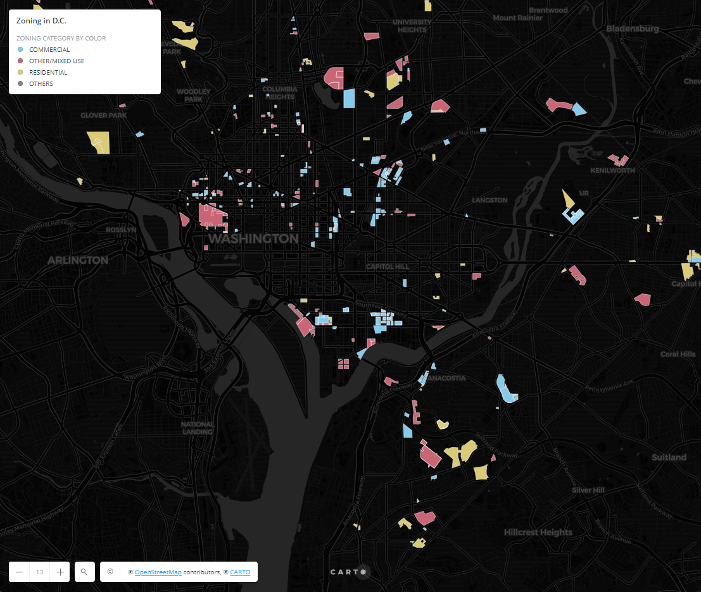

# Creating Zoning Maps Using Python & Pandas

In this lab, students are required to create a shapefile (.shp) showing the zoning-exempted buildings that provide affordable housing in the D.C. region by using Google Colab. Students should acquire the Planned Unit Developments (PUDs) information (including shapefiles and spreadsheets) as input from OpenData D.C. as of 05/04/2021, and a crosswalk table that shows equivalent elements (or "attributes") in more than one database schema. Students will learn and be able to use functions from two powerful python libraries, pandas and geopandas, and upload and create outputs on Google Drive. Finally, students will use CARTO, an online mapping webpage, to display the final output map. Below is a screenshot of the final map, and a link to the final online map. 

[CARTO FINAL MAP LINK](https://zezheng.carto.com/builder/12a2b0ff-be4a-4f33-aa64-5c65cc540e64/embed)
# Citation
This tutorial was originally created by [Nicole Janeway Bills](https://twitter.com/nicole_janeway), who provides a nice [video walkthrough on YouTube here](https://www.youtube.com/watch?v=b9G2T4CPYVM&feature=emb_logo). I've changed some of the code slightly to deal with different inputs (Open Data D.C.'s file formatting has changed since the original tutorial); added more background context on the scenario, and added the use of Carto for a final output.
